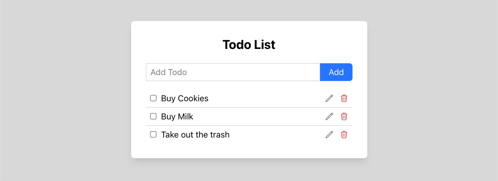

Todo List using Next.js. [See the project](https://caueamaral.github.io/next-todo).



## Technologies

- React (useEffect, useState, useRef)
- React Testing Library
- Jest
- Zustand
- Tailwind

### How to use it

1 - Clone the repository

```sh
git clone https://github.com/caueamaral/next-todo.git
```

2 - Install the dependencies

```sh
npm install
```

3 - Start the web server

```sh
npm run dev
```

4 - Open localhost in the browser

```sh
http://localhost:3000
```
